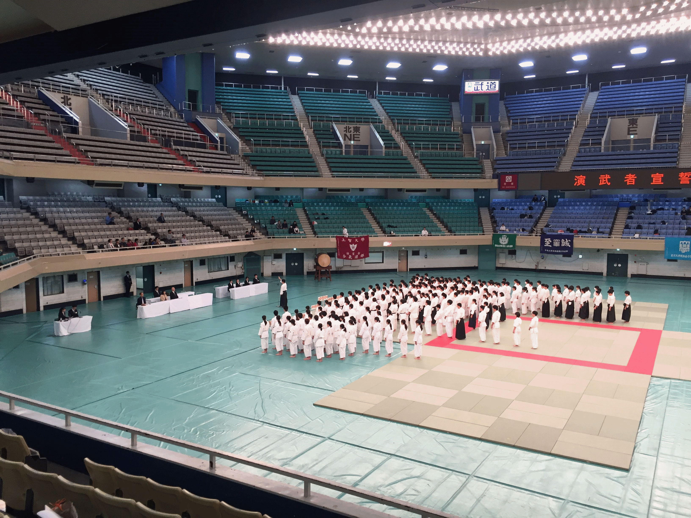

# 全日本学生合気道連盟

# メニュー
- [活動記録](index.md#activity)
- [加盟校](index.md#university)

# 活動記録
2018年10月6日 武道館演武大会

# 加盟校
- 大阪商業大学
- 関西福祉科学大学
- 金沢大学
- 京都産業大学
- 近畿大学
- 国士舘大学
- 上智大学
- 成城大学
- 専修大学
- 大正大学
- 拓殖大学
- 中央大学
- 帝京大学
- 天理大学
- 東京大学
- 東京医科大学
- 東洋英和女学院大学
- 富山大学
- 明治学院大学
- 明治大学
- 横浜国立大学
- 早稲田大学

# 連盟誌2018
- [連盟誌](renmeishi2018.pdf)
